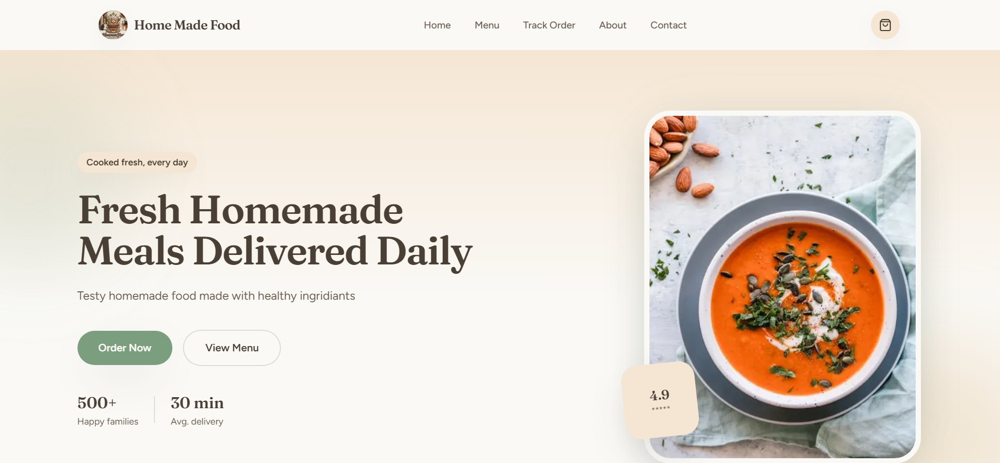
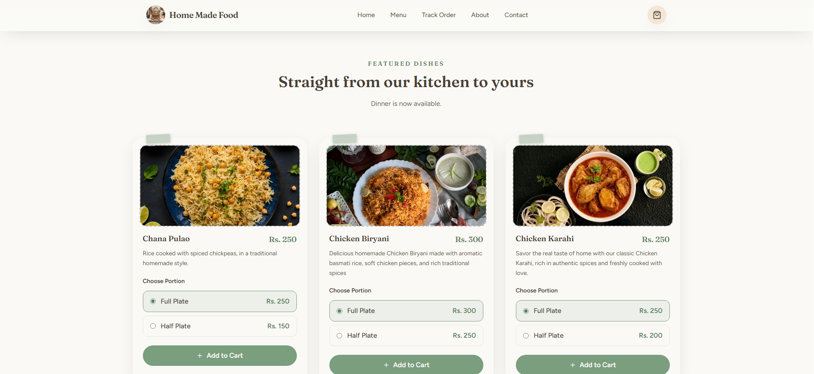
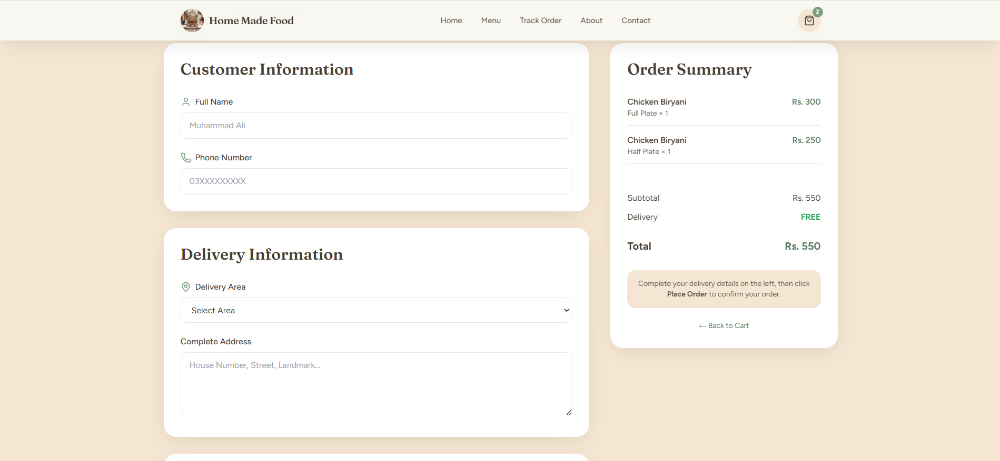
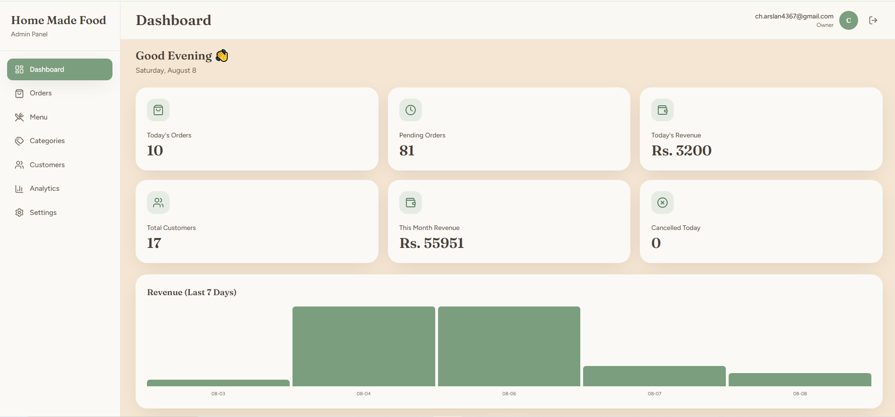

# Home Made Food — Online Food Ordering Platform

A mobile-first food ordering platform I built for a home-kitchen business in Bahawalpur. It replaces manual WhatsApp order-taking with a proper web app — customers browse the menu, order online, and track their order, while the owner runs everything (menu, orders, delivery zones, payments) from an admin dashboard.

**Live site:** https://homemadefood-pk.vercel.app/
**Repository:** https://github.com/arslan-arif6/Food_0dering-platform

---

## Why I built this

The business was running entirely on WhatsApp — customers messaging in orders, the owner manually tracking what's available, what's been ordered, and who's paid. It worked, but it didn't scale and it wasn't easy to manage. I built this to turn that into a real ordering system: customers get a proper menu and checkout flow, and the owner gets a dashboard instead of a chat history to dig through.

The goal from the start was to keep it appropriately scoped — this is a single-restaurant, single-owner business, so I avoided over-engineering it with things like multi-branch support or a rider-assignment system it doesn't need yet.

---

## Screenshots

<!--
Add your screenshots here before publishing. A few tips:
1. Create a `screenshots/` folder in the repo root and drop your images in there (e.g. screenshots/home.png, screenshots/menu.png, screenshots/checkout.png, screenshots/admin-dashboard.png)
2. Reference them below with relative paths so they render on GitHub
3. Keep each image under ~1–2MB and use PNG or WebP for crisp UI screenshots
-->

**Home page**


**Menu**


**Checkout**


**Admin dashboard**


---

## What it does

### For customers

- Mobile-first landing page and menu
- Dishes organized by category, with breakfast / lunch / dinner availability
- Half / full portion variants with dynamic pricing
- Cart that persists across visits
- Checkout with delivery area selection, address, and order notes
- Minimum order amount and delivery fee logic, including a free-delivery threshold
- Orders are blocked outside business hours or when an item isn't available
- Order confirmation and order tracking pages
- Cash on Delivery, JazzCash, and Easypaisa as payment options

### For the owner (admin panel)

- Secure login with MFA support for the owner account
- Multi-admin support with owner/admin role separation
- Order management with status updates
- Menu and category management
- Customer records
- Restaurant settings — business hours, delivery zones and fees, minimum order, payment methods, restaurant info
- Basic analytics on orders

### Security

I treated this as a core part of the build rather than something to bolt on afterward:

- Supabase Row Level Security on every table that needs it
- Role-based authorization split between owner and admin, enforced both in RLS and in the server actions themselves (defense in depth)
- MFA required for the owner account
- All admin mutations go through server-side authorization checks, not just hidden UI
- Order pricing is recalculated server-side, so it can't be tampered with from devtools
- Public read / admin write separation on storage buckets
- No secrets or `.env` files in the repo

---

## Architecture

```
Customer
  Home -> Menu -> Cart -> Checkout -> Place Order
       |
       v
Next.js Application
  App Router, Server Components, Client Components,
  Server Actions, form validation, auth/authorization
       |
       v
Supabase
  PostgreSQL, Auth, Row Level Security, Storage
```

Admin write operations go through an extra layer before they touch the database:

```
Request -> Authentication -> Admin/Owner Authorization -> Server Action -> Supabase RLS -> Database
```

So the app isn't relying on the frontend to keep people out of admin-only actions — it's checked at the server-action level and again at the database level.

---

## Tech stack

**Frontend:** Next.js 16 (App Router), React 19, TypeScript, Tailwind CSS, React Hook Form, Zod, Lucide React, Sonner

**Backend & data:** Supabase (Auth, Storage, Postgres), Row Level Security, Server Actions

**Deployment:** Vercel

---

## Project scope

This is built for a single restaurant with one owner and a small admin team — around 30 menu items, mobile-first customers, and manual payment handling (COD, JazzCash, Easypaisa).

I deliberately left out things it doesn't need yet:

- Multi-restaurant / multi-branch support
- Rider/driver assignment
- A full coupon engine
- Microservices — there's no reason for that at this scale

Keeping the scope tight means it's actually maintainable by one person, which matters more here than looking "enterprise."

---

## Getting started

Clone the repo:

```bash
git clone https://github.com/arslan-arif6/Food_0dering-platform.git
cd Food_0dering-platform
```

Install dependencies:

```bash
npm install
```

Create a `.env.local` file:

```env
NEXT_PUBLIC_SUPABASE_URL=your_supabase_project_url
NEXT_PUBLIC_SUPABASE_ANON_KEY=your_supabase_anon_key
SUPABASE_SERVICE_ROLE_KEY=your_supabase_service_role_key
```

Never commit `.env.local` or expose the service-role key.

Run the dev server:

```bash
npm run dev
```

Then open `http://localhost:3000`.

For a production build:

```bash
npm run build
```

---

## Project structure

```
app/
  admin/
  api/
  checkout/
  menu/
  order-success/
  order-tracking/
  actions/
  layout.tsx
  page.tsx
  robots.ts
  sitemap.ts

components/
  admin/
  cart/
  checkout/
  home/
  menu/

lib/
  database/
  restaurant/
  supabase/
  utils/
  validations/
```

---

## What I tested before deploying

**Customer side:** menu browsing, category filters, cart operations and persistence, checkout, form validation, delivery fee calculation, order placement, confirmation, order tracking, mobile navigation, 404 handling.

**Admin side:** login/logout, protected routes, MFA, receiving orders, updating order status, menu and category management, customer records, settings.

**Production:** deployment itself, environment variables, RLS policies, storage policies, admin authorization, unauthorized-access handling, `robots.txt` and `sitemap.xml`, error and loading states.

---

## What I learned building this

This was my first real end-to-end production project, and it forced me to actually deal with things a tutorial never covers — designing a Postgres schema that holds up under RLS, wiring up Supabase Auth and MFA properly, catching a client-side price manipulation bug before it shipped, and debugging issues that only show up in production. It's one thing to build a UI; it's another to take something from an idea through architecture, security, testing, and an actual deployment that real customers use.

---

## What's next

Things I'd add as the business grows, without overcomplicating what's already working:

- Customer accounts and order history
- Automated WhatsApp order notifications
- A real online payment gateway instead of manual JazzCash/Easypaisa
- PWA support
- Customer reviews
- Deeper reporting/analytics
- Automated database backups

---

## Author

**Arslan Arif**
BS Software Engineering student, full-stack developer

I built this from scratch for a real local business — not as a portfolio filler, but as a way to actually learn the full lifecycle of shipping software: idea, architecture, development, database design, security, testing, and deployment.

---

## License

This project is intended primarily as a portfolio and demonstration project.

© 2026 Arslan Arif. All rights reserved.
